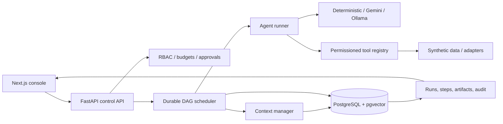

# Architecture

AgentPlane separates control-plane state from execution. FastAPI owns configuration, authorization, orchestration, checkpoints, and traces. Worker execution is currently in-process to keep local operation simple; the database remains the authority, so nodes can later move to a queue without changing the workflow model.

The core persistence boundary includes `Workflow`, `Run`, and `StepRun`. A workflow is immutable-by-version configuration; a run stores mutable shared state; every node has an independently checkpointed attempt and trace. `Artifact` is the handoff primitive. `Memory` is policy-controlled context, not an automatic transcript.

Primary extension seams are model providers, tool handlers/MCP adapters, context retrieval/ranking, queue-backed execution, and evaluator plugins. See [ORCHESTRATION.md](ORCHESTRATION.md) for state transitions.

