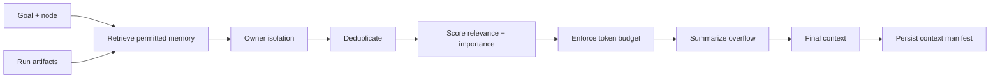

# Context engineering

The context manager is a dedicated boundary between stored knowledge and a model call.

Memory scopes are allow-listed by each agent's `context_policy`. Owner-scoped records are visible only to the owning agent; records without an owner are shared. Candidates are ranked using importance plus lexical relevance in the local implementation. Exact normalized duplicates are removed. Items outside the token budget are summarized to a bounded excerpt or dropped.

Every `StepRun.context_manifest` records item IDs/types/scores/token estimates, dropped count, and the effective policy. It intentionally omits full content from the trace manifest to reduce unnecessary duplication and exposure; the authoritative artifact or memory remains separately governed.

For a larger deployment, replace lexical scoring with pgvector nearest-neighbor retrieval and replace excerpt summaries with a versioned summarizer. Keep the same manifest contract so executions remain reproducible.

