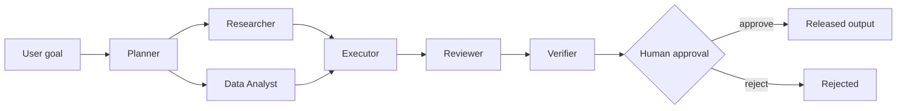

# Demo: fictional SaaS churn

The demo goal is: “Analyze a fictional SaaS company's customer churn problem and produce an action plan.” All customer rows and reports are synthetic and live under `apps/api/data`.

The data agent uses two allow-listed metrics over `customers.csv`. The researcher searches three internal synthetic reports and a mock external index. Their artifacts fan in to the executor. The reviewer calls out sample size, causality, and confounding. The verifier checks artifact completeness, quantitative provenance, uncertainty disclosure, and action ownership. The human gate is persisted only after verification.

Run it from the Dashboard or `POST /api/v1/runs`. Inspect `GET /api/v1/runs/{id}` to see every context manifest, tool call, model record, artifact, token/cost figure, timing, and evaluation.

