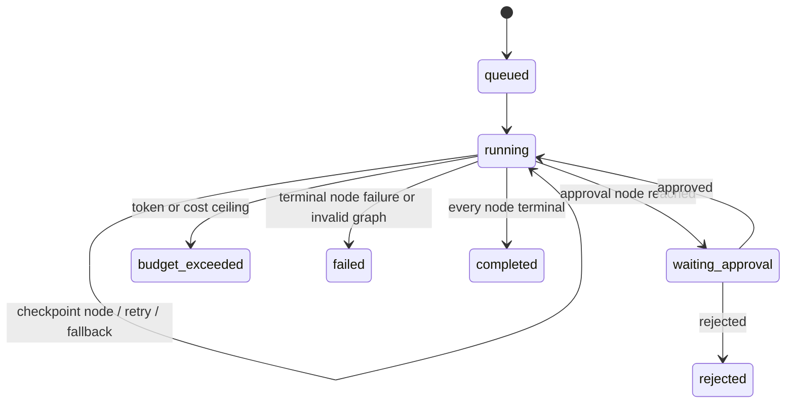

# Orchestration

Workflows are persisted DAG definitions. A node declares `kind`, `agent`, `depends_on`, `retries`, optional `fallback_agent`, optional `condition`, and its output `artifact`. Ready nodes have all dependencies in `completed` or `skipped`; all ready nodes execute concurrently. This provides sequential chains and parallel fan-out/fan-in with one scheduler rule.

Conditions use a bounded `{path, equals}` comparison over run state rather than executable expressions. Tool and model work happens only inside agent nodes. Verification is an agent node with an explicit pass/fail artifact; approval is a control node and cannot be faked by model output.

Step status is committed before external work and after its outcome. Retry counts, errors, model metadata, exact context manifest, tool calls, usage, cost, evaluation, and result are retained. See [RESUME.md](RESUME.md) for crash semantics.

