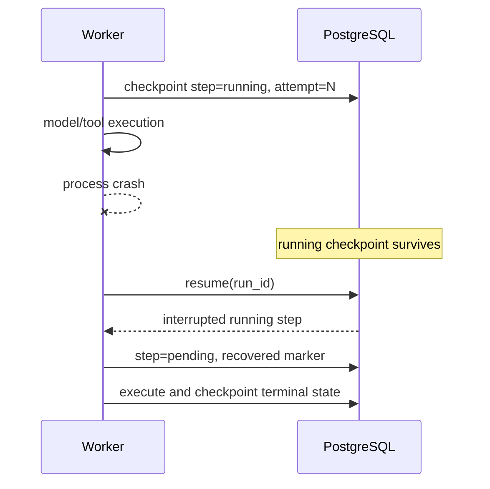

# Crash recovery and resume

The database is the source of truth. Before work begins a step is committed as `running` with its attempt number and input. On success, output, artifacts, memories, trace fields, and terminal status are committed. When `resume(run_id)` sees a step left in `running`, it requeues it and records an interruption marker.

At-least-once execution means tools with side effects need idempotency keys derived from run/node/attempt. The bundled tools are read-only or simulated. In production, record a tool-call intent before dispatch and reconcile unknown outcomes rather than blindly repeating them.

Resume is available through `POST /api/v1/runs/{id}/resume`. An approved run also resumes automatically. Completed, rejected, failed, and budget-exceeded runs are terminal.

